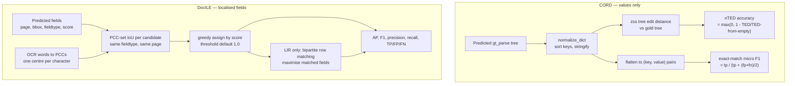

# CORD and DocILE: Formats, Scorers, and What Their Metrics Actually Measure

**Why both formats, in one paragraph.** Donut's normalised tree-edit distance (nTED) gives partial
credit, but it is weighted by character count — a missed supplier address costs far more than a
missed quantity of `1` — and its companion F1 is exact-match with no partial credit at all. DocILE
inverts the emphasis: its matching is purely positional and never compares text. So **CORD cannot
tell whether a value was read from the right place on the page, and DocILE cannot tell whether the
transcription is right.** The two blind spots are complements, and that complementarity is the
practical argument for funding the Tier 2 (DocILE) work rather than stopping at Tier 1 (CORD). The
mechanics behind this claim are in §4; everything before it is the groundwork.

---

**Purpose.** A single explainer for the two public schemas the `Synthetic_Doc_Generation` export path
targets — **CORD** (Tier 1) and **DocILE** (Tier 2) — and for the metrics each unlocks. It covers what
the datasets are, the exact shape of their annotations, the published scoring code, and what each
metric rewards, penalises, and cannot see.

**Relationship to the other documents in this workspace.**

- `GroundTruth_Export_Spec.md` §4 (CORD) and §5 (DocILE) remain the **authoritative field mappings**.
  Where a `fieldtype` string is in question, spec §5.4 is the authority — it records byte-exact
  confirmation against primary sources.
- `DocILE_and_MIT_Scorer.md` is the short orientation to DocILE and its licence scoping. This
  document is the deeper treatment and covers CORD alongside it.
- Nothing here supersedes those. Where this document found a discrepancy in them, it is recorded in
  §7 rather than silently corrected.

All external claims below were re-verified against primary sources on 30 July 2026 (fetched
directly, not recalled) except where §8 marks them otherwise.

---

## 1. At a glance

| | CORD | DocILE |
|---|---|---|
| Full name | Consolidated Receipt Dataset | Document Information Localization and Extraction |
| Document domain | Indonesian shop and restaurant receipts | Business invoices and purchase orders |
| Published by | Clova AI / NAVER | Rossum |
| Paper | Park et al., Document Intelligence Workshop @ NeurIPS 2019 | [arXiv:2302.05658](https://arxiv.org/abs/2302.05658) |
| Corpus size | over 11,000 receipts collected; **1,000 publicly released** (800 train / 100 dev / 100 test) | 6.7k annotated, 100k synthetic, ~1M unlabelled |
| Annotation unit | A nested **value tree** (`gt_parse`) per document | Individual **localised fields** per document |
| Coordinates | Not needed for the `gt_parse` task | **Mandatory** — both tasks are localisation-based |
| Taxonomy | five superclasses, 42 subclass labels | 35 KILE + 19 LIR fieldtypes (see §7.2 on the "55 classes" claim) |
| Scorer | Donut `JSONParseEvaluator` (`donut/util.py`) | `docile-benchmark` → `evaluate_dataset()` |
| Metrics | normalised tree-edit-distance accuracy + field-level F1 | AP, plus F1 / precision / recall |
| Scorer licence | MIT | MIT |
| **Dataset** licence | **CC BY 4.0** | separate research terms, Dataset Access Request required |
| Tier for this project | **Tier 1** — ships from current YAML | **Tier 2** — blocked on box capture |

The licence asymmetry is worth internalising: for CORD, both the code and the data are permissive;
for DocILE, only the *code* is MIT. Exporting in-house Australian data into the DocILE format and
scoring it with the MIT scorer stays inside the permissive scope — redistributing DocILE's own
documents would not.

---

## 2. CORD

### 2.1 What it is

CORD is a receipt-parsing dataset: photographed Indonesian receipts with word-level OCR boxes,
category labels, and group identifiers, published as the reference corpus for **post-OCR parsing**
— turning recognised text into a structured record. Its README states the collection is "over
11,000 Indonesian receipts collected from shops and restaurants" with "five superclass and 42
subclass labels"; the public release on Hugging Face is 1,000 images split 800 / 100 / 100. The
five superclasses are `menu`, `void_menu`, `subtotal`, `total`, and `void_total`. Licence: Creative
Commons Attribution 4.0.

Two release lines exist. `cord-v1` is the original; **`cord-v2`** carries corrected labels and adds
hierarchy information via `sub_group_id`. The v2 line is the one Donut trains and evaluates against,
and the one this project's Mapping A follows.

### 2.2 The annotation shape that matters

CORD ships two things, and it is easy to conflate them:

1. The **raw annotation** — `valid_line` entries with word-level quadrilateral coordinates, text,
   category, and group id. This is the OCR-plus-labels view.
2. The **`gt_parse` tree** — a nested JSON object of *values only*, no coordinates. This is what
   Donut consumes as its target sequence, and it is what Mapping A emits.

Mapping A targets (2). That single choice is why CORD is Tier 1 for this project: the pipeline's
ground-truth YAML already holds every value the tree needs, so no renderer change is required.

The tree's core paths, as used by the mapping:

| `gt_parse` path | Meaning |
|---|---|
| `menu[i].nm` | line-item name |
| `menu[i].cnt` | count / quantity |
| `menu[i].unitprice` | unit price |
| `menu[i].price` | line total |
| `sub_total.tax_price` | tax component |
| `total.total_price` | document total |

Note `sub_total` in the tree versus the `subtotal` superclass name in the label taxonomy — the
underscore is real and load-bearing.

### 2.3 Worked example — `CASE001` receipt

Values are the live ones from `ground_truth/receipts.yml:1-16`: line items `4.73 + 8.87 = 13.60`,
and `13.60 / 11 = 1.236…` rounding to the stored GST of `1.24`.

```json
{
  "menu": [
    {"nm": "Dishwashing Liquid", "cnt": "1", "unitprice": "4.73", "price": "4.73"},
    {"nm": "Bandaids 40pk", "cnt": "1", "unitprice": "8.87", "price": "8.87"}
  ],
  "sub_total": {"tax_price": "1.24"},
  "total": {"total_price": "13.60"},
  "extension": {
    "supplier_name": "Ravensdale Health Store",
    "business_abn": "79 104 332 181",
    "business_address": "400 Stewart Rd, South Yarra VIC 3141",
    "invoice_date": "07/07/2024"
  }
}
```

CORD is receipt-body-centric: it has no labelled slot for supplier name, ABN, address, or document
date. Mapping A parks those under a single `extension` object rather than distorting them into
`menu` or `total` — and, per spec §4.3, the scoring decision (exclude `extension` from the tree-edit
distance for public comparability, or score it separately) must be documented.

### 2.4 The metrics

Donut's `JSONParseEvaluator` in `donut/util.py` provides two, both verified by reading the source.

**Normalised tree-edit-distance accuracy (nTED).**

```
accuracy = max(0, 1 - TED(pred, gt) / TED({}, gt))
```

The denominator is the cost of building the gold tree from nothing, so the score is the fraction of
that work the prediction got right, floored at 0. Tree edit distance comes from the `zss` library
(Zhang–Shasha). The cost model is what gives the metric its character:

| Operation | Cost |
|---|---|
| Update, both nodes leaves | string edit distance between the two labels |
| Update, one node a leaf | `1 + len(leaf_label)` |
| Update, neither a leaf | `0` if labels identical, else `1` |
| Insert / remove | `len(label)` for a leaf, else `1` |

Consequences: **partial credit is real** — a near-miss on a long value costs only its character-level
edit distance, so `"Ravensdale Health Store"` predicted as `"Ravensdale Health Stroe"` loses a
little, not everything. But **long values dominate the score**, because insert/remove cost scales
with string length. A missed supplier address hurts far more than a missed quantity of `1`. Before
using nTED to compare models, know that it is weighted by character count, not by field importance.

`normalize_dict` sorts dictionary keys (by length, then alphabetically) and coerces values to
strings, so **key order in the emitted JSON does not matter**.

**Field-level F1.**

```
F1 = tp / (tp + (fp + fn) / 2)
```

computed over `flatten`ed `(dotted_key, value)` pairs — `{"menu": [{"nm": "cake"}]}` becomes
`("menu.nm", "cake")`. This is micro-averaged and **exact-match**: no partial credit at all. A
single wrong character is a full miss, counting once as a false positive and once as a false
negative.

The two metrics are therefore complementary, not redundant. Report both: nTED shows how close the
structure is, F1 shows how many fields are exactly right. A model can score respectably on nTED
while getting a poor F1 (many small errors everywhere), or the reverse (most fields perfect, one
long field badly wrong).

---

## 3. DocILE

### 3.1 What it is

DocILE is the largest public benchmark for field-level information extraction from business
documents, built from invoices and purchase orders. The abstract reports 6.7k annotated documents,
100k synthetic, and nearly 1M unlabelled for pre-training. It defines two tasks:

| Task | Full name | What it asks |
|---|---|---|
| **KILE** | Key Information Localisation and Extraction | For each field type, find the field on the page and return its type, page, box, and optionally text |
| **LIR** | Line Item Recognition | The same, plus grouping fields into table rows via `line_item_id` |

The decisive property: **both tasks are localisation-based**. A field with no bounding box cannot be
scored at all. This is the whole reason DocILE is Tier 2 for this project while CORD is Tier 1.

### 3.2 The annotation shape

A field is `{page, bbox, fieldtype, text?, score?, line_item_id?, use_only_for_ap?}`, where `bbox` is
`[left, top, right, bottom]` in **relative 0–1 page coordinates, origin top-left** (y increasing
downward). LIR fields add `line_item_id` as the row grouping key. `use_only_for_ap: true` marks a
low-confidence prediction that should count toward AP but be excluded from F1 / precision / recall.

In-memory the library requires a `BBox` object rather than a raw list — `Field.bbox` is typed `BBox`,
and `Field.from_dict` constructs `BBox(*bbox_list)` when deserialising. The 4-element list is only
the on-disk JSON form. Spec §5.4 records this in full.

### 3.3 Worked example — `CASE001` KILE fragment

Boxes are placeholders pending box capture; dates and amounts are the live ground-truth values.

```json
{
  "kile": [
    {"page": 0, "fieldtype": "vendor_name", "text": "Ravensdale Health Store",
     "bbox": [0.08, 0.04, 0.62, 0.09]},
    {"page": 0, "fieldtype": "vendor_registration_id", "text": "79 104 332 181",
     "bbox": [0.08, 0.10, 0.55, 0.14]},
    {"page": 0, "fieldtype": "date_issue", "text": "07/07/2024",
     "bbox": [0.70, 0.10, 0.95, 0.14]},
    {"page": 0, "fieldtype": "amount_total_gross", "text": "13.60",
     "bbox": [0.72, 0.86, 0.95, 0.90]}
  ],
  "lir": [
    {"page": 0, "line_item_id": 0, "fieldtype": "line_item_description",
     "text": "Dishwashing Liquid", "bbox": [0.06, 0.40, 0.55, 0.44]},
    {"page": 0, "line_item_id": 0, "fieldtype": "line_item_quantity",
     "text": "1", "bbox": [0.56, 0.40, 0.62, 0.44]}
  ]
}
```

### 3.4 The metrics

`evaluate_dataset()` in `docile/evaluation/evaluate.py`, verified by reading the source:

```python
def evaluate_dataset(
    dataset: Dataset,
    docid_to_kile_predictions: Mapping[str, Sequence[Field]],
    docid_to_lir_predictions: Mapping[str, Sequence[Field]],
    iou_threshold: float = 1.0,
) -> EvaluationResult:
```

It reports seven numbers per task — **AP, F1, precision, recall, TP, FP, FN** — micro-averaged over
all fields and documents. AP uses every prediction and is computed COCO-style with the
precision–recall curve made non-increasing ("gaps filled"), which is why predictions carry an
optional `score`: AP needs a ranking. F1 / precision / recall exclude predictions flagged
`use_only_for_ap`. `print_report()` can break results down per fieldtype via `include_fieldtypes`.

Headline convention in the literature and in `DocILE_and_MIT_Scorer.md`: **AP for KILE, micro-F1 for
LIR**. Both are available for both tasks; that pairing is the reporting convention, not a limit of
the code.

### 3.5 Pseudo-Character-Centre matching — the part that surprises people

DocILE does **not** match predictions to gold by geometric box overlap. Matching is
Pseudo-Character-Centre (PCC) based, CLEval-style, and the details have real consequences for an
exporter.

How PCCs are built (`docile/evaluation/pcc.py`): they are derived from the document's **OCR words
that were snapped to text**. Each word's box is divided equally among its characters — character
width `(right - left) / len(text)`, vertical position the midpoint of the word box, and character
*i* centred at `left + (i + ½) · char_width`. One PCC per character.

How matching then works (`docile/evaluation/pcc_field_matching.py`):

- Candidates are restricted to gold fields of the **same `fieldtype` on the same page**.
- Overlap is `len(gold_pccs ∩ pred_pccs) / len(gold_pccs ∪ pred_pccs)` — an **IoU over sets of
  character centres**, not over box areas. The `iou_threshold` parameter is misleadingly named: it
  is a PCC-set IoU, not geometric IoU.
- Assignment is **greedy in descending prediction score**; each prediction takes the first eligible
  gold, which is then removed from the pool.
- **Text is not compared during matching.** Text equality is available only as a separate optional
  `filter` step (`if gold is not None and same_text and pred.text != gold.text`) that can unmatch an
  already-matched pair.

Two things follow. First, the **default `iou_threshold = 1.0` is strict**: the predicted box must
cover exactly the same set of character centres as the gold box — effectively "the same words, no
more, no fewer". A box that spills onto an adjacent word fails. Second, because matching is scored
on localisation and not on text, a model can score well on KILE while transcribing a value wrongly;
if value correctness matters for the use case, it must be checked separately.

For LIR, `docile/evaluation/line_item_matching.py` builds a bipartite graph between predicted and
gold line items and finds the **maximum matching that maximises the total number of matched fields**
(edges weighted `-main_prediction_matches`, solved with NetworkX `minimum_weight_full_matching`).
Row identity is thus inferred from field agreement — a predicted row need not carry the same
`line_item_id` integer as the gold row it matches. Field-level matching inside a paired row uses
`get_matches()` with the same `iou_threshold`.

### 3.6 The consequence the spec calls a "box dependency" is bigger than boxes

Because PCCs come from OCR words, a conforming gold `Dataset` needs a **word-level OCR layer**, not
merely one box per field. For a Pillow renderer this is an advantage rather than a burden — the
generator knows every word's position at draw time, so it can emit a perfect synthetic OCR layer
instead of running a recogniser. But it does change the shape of the upstream work: capture must be
at **word** granularity, with field-level boxes derived from the words they span.

`GroundTruth_Export_Spec.md` §9 frames the dependency as field-box capture. That is necessary but
not sufficient; the OCR-word requirement should be read as part of the same task.

---

## 4. How the two metric families differ



*(Scoped to metric computation only — this is not a variant of the pipeline diagram in
`GroundTruth_Export_Spec.md` §8.6.)*

| Question | CORD metrics | DocILE metrics |
|---|---|---|
| Does the value have to be exactly right? | F1 yes; nTED gives partial credit | Not for matching at all — text is optional and unchecked |
| Does position matter? | No | Yes — it is the whole basis of matching |
| Is confidence used? | No | Yes — AP needs `score`; greedy assignment is score-ordered |
| Are long fields weighted more? | Yes, nTED cost scales with string length | No — one field, one match |
| Can structure be partially right? | Yes, TED absorbs it | Only via LIR row matching |
| Blind spot | Cannot tell whether the value was read from the right place on the page | Cannot tell whether the transcription is correct |

This is the mechanism behind the opening paragraph: running both scorers is how you learn that a
model *read the right text* **and** *read it from the right place*. Either metric family alone
leaves one of those two questions unasked.

---

## 5. Practical adoption cost

| | CORD | DocILE |
|---|---|---|
| Install | `pip install donut-python`, or copy `util.py` (deps `zss`, `nltk`) | `pip install docile-benchmark` (pure pip, air-gap vendorable) |
| What you must build | emit `gt_parse` JSON, call the evaluator | a conforming `Dataset` of gold annotations with an OCR layer, plus `Field` predictions with correct `bbox` / `fieldtype` / `line_item_id`, passing the library's validation |
| Effort in spec terms | **thin adapter** | **substantial** |
| Upstream blocker | none | word-level box capture at draw time |

One licence caveat carried over from spec §8.5: `zss` (Donut's tree-edit-distance dependency) is
reported non-SPDX / historically GPL. `apted` (MIT) is the preferred building block where a
substitution is possible — though substituting it inside `JSONParseEvaluator` changes the metric
implementation and would break comparability with published CORD numbers. Decide deliberately.

---

## 6. Why this matters for `Synthetic_Doc_Generation`

- **CORD is reachable today.** Values-only, no coordinates, and the receipt/invoice field subsets
  already hold everything `gt_parse` needs. It buys a published MIT metric for adapter-only cost.
- **CORD does not cover the whole document set.** It is receipt-shaped: bank statements, credit-card
  statements, and all four trust-distribution types have no CORD home, and supplier/ABN/date land in
  `extension`. CORD scores part of the benchmark, not the benchmark.
- **DocILE is the stronger claim and the larger bill.** It is the format that makes "our synthetic
  Australian corpus is scored by published, peer-reviewed machinery" credible, and it is gated on
  word-level box capture.
- **The precedent is favourable.** DocILE's own 100k synthetic subset was produced by a bespoke,
  proprietary, rule-based synthesiser and validated empirically. Bespoke generator → recognised
  format → recognised scorer is the accepted construction, which is exactly this project's shape.

---

## 7. Discrepancies found while writing this document

Two were fixed in `GroundTruth_Export_Spec.md` on 30 July 2026 (§7.1, §7.3). The remainder are
recorded, not fixed, so the owners of the affected files can decide.

### 7.1 `CASE001` date drift in the spec — **resolved 30 July 2026**

`GroundTruth_Export_Spec.md` carried `02/03/2023` as the `CASE001` date in §4.2 (prose and
`gt_parse` example), §5.3 (`date_issue`), §6.1 and §6.2. The live ground truth has
`INVOICE_DATE: 07/07/2024` for both the `CASE001` receipt (`ground_truth/receipts.yml:9`) and the
`CASE001` invoice (`ground_truth/invoices.yml:9`).

All five sites now carry `07/07/2024`. Re-verifying §6.1 — which is labelled "verbatim" — turned up
three further drifts in the same block, now also corrected: `bank_description` was
`VISA DEBIT PURCHASE RAVENSDALE HEALTH STORE Alexandria AU` where the live file has
`VISA DEBIT PURCHASE SQ *RAVENSDALE Alexandria AU`; `match_difficulty` was `easy` where the live
file has `medium`; and the `notes` string omitted the "abbreviated merchant reference" clause. The
§6.2 emitted-JSON example was updated to match.

`Export_Implementation_Plan.md` carried the same stale vintage in 14 places and was audited on the
same date. Eleven were genuine `CASE001` claims and are fixed: the Task 1 prose (line 52), the Task 1
Step 4 replacement text for spec §4.2 and §6.1 (which must match what was applied to the spec, or the
next person executing that step would reintroduce the errors), and the `test_cord.py`,
`test_docile.py` and `test_links.py` fixtures. Making the `test_links.py` fixture faithful changed
its `match_difficulty` from `easy` to `medium`, which required updating the coupled assertion in
`test_one_source_with_several_targets_yields_several_records` to `{"medium", "hard"}`.

The remaining three occurrences were **left deliberately**: the `test_native.py` `BANK` fixture is an
invented statement (supplier `CBA`, payer `J Smith`, `STATEMENT_DATE_RANGE: 01/03/2023 - 31/03/2023`),
not `CASE001`. Its `02/03/2023` transaction dates must stay inside that March 2023 window; rewriting
them to `07/07/2024` would put transactions outside their own statement period. A note at that
fixture now records why, so a future find-and-replace does not break it.

Task 1 of the plan remains open for the parts not covered here: spec §6.3's trust-quad anchor and
`linking_fields`, spec §1 and §11, and the `README.md` corrections.

### 7.2 DocILE class count: 55 versus 54 (external, minor)

The paper's abstract advertises "annotations in 55 classes". Tables 1–2 of the Supplementary
Material enumerate 35 KILE and 19 LIR fieldtypes, which totals 54. The discrepancy is unresolved —
possibly an overlapping or auxiliary category. It has no effect on the mappings, which name
individual fieldtype strings confirmed byte-exact in spec §5.4, but the "55" figure should not be
repeated as though cross-checked.

### 7.3 `PAYMENT_DUE_DATE → date_due` mapped a field invoices do not have — **resolved 30 July 2026**

Spec §5.1 listed `PAYMENT_DUE_DATE` → `date_due` in the KILE mapping for invoices and receipts. In
`config/field_definitions.yml`, `PAYMENT_DUE_DATE` appears only in the **`cc_statement`** subset
(line 56) — neither the invoice nor the receipt subset contains it, so the row was unreachable.

The row has been removed from the §5.1 table and replaced by a "held in reserve" note recording that
the `PAYMENT_DUE_DATE → date_due` binding is correct but currently unpopulated, and that it becomes
live only if the invoice subset gains a due date (the schema change discussed in
`Invoice_vs_Receipt.md` §5). The mapping table now contains only reachable rows.

### 7.4 Line-item ordering under nTED — open question

Donut's `normalize_dict` sorts dictionary *keys*, so key order is immaterial. Whether the *order of
items within the `menu` list* affects the tree-edit distance was not established — it depends on how
`construct_tree_from_dict` emits list children. This matters because the pipeline's pipe-delimited
line-item lists have a fixed order that a model may not reproduce. **Confirm in `donut/util.py`
before relying on order-insensitivity.**

---

## 8. Verification status

| Claim | Status |
|---|---|
| CORD: "over 11,000 Indonesian receipts", "five superclass and 42 subclass labels", CC BY 4.0 | Verified — [clovaai/cord](https://github.com/clovaai/cord) `README.md`, fetched 30 July 2026 |
| CORD public split 800 / 100 / 100 = 1,000 | Verified — CORD README and [naver-clova-ix/cord-v2](https://huggingface.co/datasets/naver-clova-ix/cord-v2) |
| CORD-v2 adds corrected labels and `sub_group_id` | Verified — CORD README |
| nTED formula, zss, cost model, `normalize_dict` key sorting, `flatten`, F1 = tp/(tp+(fp+fn)/2) | Verified — [clovaai/donut `donut/util.py`](https://github.com/clovaai/donut/blob/master/donut/util.py) |
| `gt_parse` paths `menu[i].nm/cnt/unitprice/price`, `sub_total.tax_price`, `total.total_price` | Verified — cord-v2 dataset description; consistent with spec §4.1 |
| DocILE 6.7k annotated / 100k synthetic / ~1M unlabelled; KILE and LIR definitions | Verified — [arXiv:2302.05658](https://arxiv.org/abs/2302.05658) abstract |
| `evaluate_dataset` signature, `iou_threshold` default 1.0, seven metrics, `use_only_for_ap`, COCO-style gap-filled AP, per-fieldtype report | Verified — [`docile/evaluation/evaluate.py`](https://github.com/rossumai/docile/blob/main/docile/evaluation/evaluate.py) and repository `README.md` |
| PCCs built from OCR words snapped to text; one centre per character at `left + (i + ½)·char_width` | Verified — [`docile/evaluation/pcc.py`](https://github.com/rossumai/docile/blob/main/docile/evaluation/pcc.py) |
| `iou_threshold` is PCC-set IoU, not box IoU; same fieldtype and page; greedy by score; text not compared during matching | Verified — [`docile/evaluation/pcc_field_matching.py`](https://github.com/rossumai/docile/blob/main/docile/evaluation/pcc_field_matching.py) |
| LIR uses bipartite matching maximising total matched fields via `minimum_weight_full_matching` | Verified — [`docile/evaluation/line_item_matching.py`](https://github.com/rossumai/docile/blob/main/docile/evaluation/line_item_matching.py) |
| `bbox` relative 0–1, `[left, top, right, bottom]`, origin top-left; `BBox` required in memory | Verified previously — recorded in spec §5.4 |
| DocILE code MIT; dataset under separate research terms | Verified previously — recorded in `DocILE_and_MIT_Scorer.md` §4 |
| DocILE's 100k synthetic subset came from a bespoke proprietary synthesiser; pre-training helped in all but one case | Medium confidence — author-self-reported, per `DocILE_and_MIT_Scorer.md` §2 |
| "AP for KILE, micro-F1 for LIR" as the reporting convention | Verified that both metrics exist for both tasks; the *convention* is as recorded in `DocILE_and_MIT_Scorer.md` §3 |
| `zss` licence non-SPDX / historically GPL | **Unverified** — carried over from spec §8.5, flagged there as needing confirmation |
| Whether `menu` list order affects nTED | **Unverified** — see §7.4 |
| CORD paper venue: Document Intelligence Workshop @ NeurIPS 2019 | Verified — CORD README citation block |

---

**Primary sources.** [clovaai/cord](https://github.com/clovaai/cord) ·
[naver-clova-ix/cord-v2](https://huggingface.co/datasets/naver-clova-ix/cord-v2) ·
[clovaai/donut `donut/util.py`](https://github.com/clovaai/donut/blob/master/donut/util.py) ·
[arXiv:2302.05658](https://arxiv.org/abs/2302.05658) ·
[rossumai/docile](https://github.com/rossumai/docile) (`README.md`, `evaluation/evaluate.py`,
`evaluation/pcc.py`, `evaluation/pcc_field_matching.py`, `evaluation/line_item_matching.py`)
