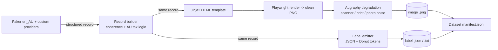

# Faker + SynthDoG-Style Pipeline for Synthetic Australian Financial Documents

> ## ⚠️ SPECULATIVE ALTERNATIVE DESIGN — NOT THE CURRENT TOOL
>
> This document is a **thought experiment**: one possible way to build a synthetic
> Australian document generator using an HTML/Playwright/SynthDoG/Augraphy stack.
> **It is not what is actually running, and the code below has never been run.**
>
> **The real, in-production tool is** `Synthetic_Doc_Generation`
> (`Synthetic_Doc_Generation`), and its stack differs on almost
> every axis. Where this doc and the real tool disagree, **the real tool wins**:
>
> | This doc (speculative) | Real `Synthetic_Doc_Generation` |
> |---|---|
> | Playwright + Jinja2 HTML rendering | **Pillow** (pinned `pillow==12.2.0`, byte-stable font metrics) |
> | Augraphy degradation | **OpenCV** (`degrade_camera_scan.py`) |
> | SynthDoG / synthtiger | **not used** |
> | "build a scoring harness" | **already built** — vendored MIT CORD evaluator + DocILE exporters in `generators/exporters/` |
> | 3 document types | **8** (4 business + 4 trust-distribution), 840 images (420 clean + 420 degraded) |
> | ad-hoc record dicts | **46-column** `config/field_definitions.yml` |
> | training / fine-tuning pairs | **VLM Information-Extraction benchmark** (answer key for scoring competing VLMs) — no fine-tuning |
> | ✅ Faker `en_AU` for content | ✅ **matches** — `Faker("en_AU")` in `generators/content_engine.py`, driven by `config/data_pools.yml` |
>
> **Purpose correction:** the goal is to *benchmark the extraction accuracy of
> competing VLMs against a labelled answer key*, not to train or fine-tune a model.
> Treat every "training", "fine-tune", and "OCR-free model" framing below as an
> artefact of an earlier misunderstanding, superseded by this banner.
>
> **Authoritative docs** for the real system (read these, not this file, for ground
> truth): `Synthetic_Business_Document_Generation_Research.md` (why),
> `GroundTruth_Export_Spec.md` (what — the 46-col schema + CORD/DocILE mappings),
> `Export_Implementation_Design.md` (how). Kept only as an alternative-stack
> reference; do not port code from here without checking it against the real repo.

A runnable sketch of a data-generation pipeline that produces perfectly-labeled
`(document_image, structured_json)` training pairs for OCR-free document
understanding models (Donut, InternVL3, Llama-Vision).

**Document types:** Tax Invoices, Receipts, Bank Statements (Australian formats).

---

## 1. Design in one paragraph

SynthDoG gives you *visual* realism (backgrounds, paper texture, scan noise) and
free reading-order labels, but its content is random Wikipedia text. We intervene
at the **content layer**: Faker (`en_AU` locale) plus custom providers generate a
semantically coherent record (valid ABN checksums, GST at the configured rate,
bank balances that reconcile). That same record is *both* the input to a template
renderer *and* the ground-truth label. A degradation stage then applies
in-the-wild noise. Result: labeled pairs at scale with zero hand-annotation.



Mapping to SynthDoG's four layers: **background/paper/augmentation** are handled
by Augraphy (a document-specific augmentation engine); **text/layout** are handled
by Faker + Jinja2 templates instead of SynthDoG's corpus sampler. If you must stay
inside SynthDoG proper, swap the Augraphy stage for `synthtiger` and feed Faker
strings into its layout config; the record/label contract is unchanged.

---

## 2. Directory layout

```
au_docgen/
├── environment.yml                 # conda env (tests local-only, see CLAUDE.md)
├── config/
│   └── run_config.yml              # SINGLE SOURCE OF TRUTH — all knobs live here
├── src/
│   └── au_docgen/
│       ├── __init__.py
│       ├── cli.py                  # typer entrypoint: `au-docgen generate`
│       ├── config.py               # loads + fail-fast validates run_config.yml
│       ├── providers/
│       │   ├── __init__.py
│       │   └── au_finance.py       # custom Faker Provider (BSB, AUD, line items)
│       ├── builders/
│       │   ├── __init__.py
│       │   ├── invoice.py          # tax-invoice record (GST arithmetic)
│       │   ├── receipt.py          # GST-inclusive receipt record
│       │   └── bank_statement.py   # reconciling running-balance ledger
│       ├── render/
│       │   ├── __init__.py
│       │   ├── html_renderer.py    # Jinja2 -> HTML -> Playwright PNG
│       │   └── degrade.py          # Augraphy pipeline (config-driven)
│       ├── labels/
│       │   ├── __init__.py
│       │   └── emit.py             # record -> JSON + Donut token string
│       └── pipeline.py             # orchestrates build -> render -> degrade -> label
├── templates/                      # many layouts per type -> avoid overfitting
│   ├── invoice/{modern,classic,minimal}.html.j2
│   ├── receipt/{thermal,a4}.html.j2
│   └── bank_statement/{cba_like,generic}.html.j2
├── assets/
│   ├── fonts/                      # varied fonts (layout diversity)
│   └── backgrounds/                # desk/photo backgrounds for degradation
├── output/                         # generated dataset (gitignored)
│   ├── images/
│   ├── labels/
│   └── manifest.jsonl
└── tests/                          # gitignored, local-only, pytest, >=80% cov
    ├── test_providers.py
    ├── test_builders.py            # assert GST + balance arithmetic
    └── test_labels.py
```

---

## 3. Environment (`environment.yml`)

All dependencies are permissively licensed (MIT / BSD / Apache-2.0). No copyleft
(GPL/LGPL/AGPL) in the stack — note the deliberate choice of Playwright over
`wkhtmltoimage`/`imgkit`, which are LGPL/GPL. License column travels with the code.

```yaml
name: au_docgen
channels: [conda-forge]
dependencies:
  - python=3.12                   # PSF (permissive)
  - pip                           # MIT
  - pyyaml                        # MIT
  - jinja2                        # BSD-3-Clause
  - typer                         # MIT
  - rich                          # MIT
  - pillow                        # MIT-CMU (HPND)
  - numpy                         # BSD-3-Clause
  - opencv                        # Apache-2.0 (opencv >= 4.5)
  - pip:
      - faker>=25                 # MIT — HTML -> PNG stack + fake data
      - playwright>=1.44          # Apache-2.0 — HTML -> PNG (playwright install chromium)
      - augraphy>=8.2             # MIT — document-specific degradation
      - pytest                    # MIT
      - pytest-cov                # MIT
```

> **Also vet, outside this file:** (1) **fonts** in `assets/fonts/` — use SIL Open
> Font License faces (Google Fonts), never redistribute system fonts (Helvetica,
> Arial, Calibri). (2) **Model weights** for the fine-tune target — Donut is MIT and
> clean, but Llama-Vision (community license, use restrictions) and some InternVL3
> checkpoints are not permissive; check the specific model-card license first.

```bash
conda env update -f environment.yml --prune
conda activate au_docgen
playwright install chromium
```

---

## 4. Config as single source of truth (`config/run_config.yml`)

Every runtime knob lives here. Python reads it and fails fast on missing keys.
No hardcoded defaults (no GST rate, counts, or paths shadowed in code).

```yaml
locale: en_AU
seed: 1337                          # reproducibility; passed to Faker + numpy

tax:
  gst_rate: 0.10                    # required; do NOT hardcode in Python
  currency_symbol: "$"
  date_format: "%d/%m/%Y"          # Australian day-first

generate:
  tax_invoice:   { count: 5000, min_line_items: 1, max_line_items: 12 }
  receipt:       { count: 5000, min_line_items: 1, max_line_items: 8 }
  bank_statement:{ count: 2000, min_txns: 8, max_txns: 40 }

templates:
  tax_invoice:    [invoice/modern.html.j2, invoice/classic.html.j2, invoice/minimal.html.j2]
  receipt:        [receipt/thermal.html.j2, receipt/a4.html.j2]
  bank_statement: [bank_statement/cba_like.html.j2, bank_statement/generic.html.j2]

render:
  viewport: { width: 1240, height: 1754 }   # ~A4 @ 150 dpi
  deterministic_fonts: false                 # randomise fonts per doc

degrade:
  enabled: true
  augraphy_preset: default                    # ink/paper/post phase presets
  augment_probability: 0.9                    # fraction of docs that get degraded

output:
  root: output
  label_formats: [json, donut_tokens]         # emit both
  manifest: output/manifest.jsonl
```

**Fail-fast loader (`src/au_docgen/config.py`)** — every validation error states
what is wrong, where to fix it, what a valid value looks like, and how to recover:

```python
"""Configuration loading with fail-fast diagnostics."""

from pathlib import Path
from typing import Any

import yaml

REQUIRED_TOP_LEVEL = ("locale", "seed", "tax", "generate", "templates", "render",
                      "output")
REQUIRED_TAX = ("gst_rate", "currency_symbol", "date_format")


def _fail(what: str, path: Path, key: str, example: str) -> None:
    """Raise a diagnostic config error (what / where / valid shape / recovery)."""
    raise ValueError(
        f"Config error: {what}.\n"
        f"  Where: {path.resolve()} -> key '{key}'\n"
        f"  Expected: {example}\n"
        f"  Recover: add the key under '{key.split('.')[0]}:' in run_config.yml."
    )


def load_config(path: Path) -> dict[str, Any]:
    """Load and validate run_config.yml.

    Args:
        path: Absolute path to run_config.yml.

    Returns:
        The parsed, validated config mapping.

    Raises:
        ValueError: If any required key is missing or malformed.
    """
    if not path.is_file():
        _fail("config file not found", path, "run_config.yml",
              "a readable YAML file at config/run_config.yml")
    cfg: dict[str, Any] = yaml.safe_load(path.read_text()) or {}

    for key in REQUIRED_TOP_LEVEL:
        if key not in cfg:
            _fail(f"missing required top-level key '{key}'", path, key,
                  "see the documented run_config.yml block")
    for key in REQUIRED_TAX:
        if key not in cfg["tax"]:
            _fail(f"missing required tax key '{key}'", path, f"tax.{key}",
                  "gst_rate: 0.10  # decimal fraction, required")
    return cfg
```

---

## 5. Custom Faker provider (`src/au_docgen/providers/au_finance.py`)

Faker's `en_AU` locale already supplies `abn()`, `acn()`, `tfn()`, addresses,
states, postcodes, and company names with valid checksums. We add the finance-
specific pieces it lacks.

```python
"""Australian finance Faker provider: BSB, AUD formatting, coherent line items."""

from decimal import Decimal, ROUND_HALF_UP

from faker.providers import BaseProvider

TWO_PLACES = Decimal("0.01")


class AuFinanceProvider(BaseProvider):
    """Faker provider for Australian financial-document primitives."""

    def bsb(self) -> str:
        """Return a Bank-State-Branch code formatted ``NNN-NNN``."""
        return f"{self.random_int(0, 999):03d}-{self.random_int(0, 999):03d}"

    def account_number(self) -> str:
        """Return an 8-9 digit bank account number."""
        return "".join(str(self.random_int(0, 9)) for _ in range(self.random_int(8, 9)))

    def money(self, low_cents: int, high_cents: int) -> Decimal:
        """Return a Decimal AUD amount between the given cent bounds."""
        return (Decimal(self.random_int(low_cents, high_cents)) / 100).quantize(TWO_PLACES)

    def line_item(self) -> dict[str, object]:
        """Return one invoice/receipt line with coherent quantity and totals."""
        qty = self.random_int(1, 10)
        unit = self.money(500, 50_000)
        return {"description": self.generator.bs().title(),
                "quantity": qty,
                "unit_price": unit,
                "line_total": (qty * unit).quantize(TWO_PLACES)}
```

---

## 6. Record builders — coherence is the whole point

### Tax invoice (`src/au_docgen/builders/invoice.py`)

```python
"""Tax-invoice record builder enforcing Australian GST arithmetic."""

from decimal import Decimal, ROUND_HALF_UP
from typing import Any

from faker import Faker

TWO_PLACES = Decimal("0.01")


def build_tax_invoice(fake: Faker, gst_rate: Decimal, date_fmt: str,
                      min_items: int, max_items: int) -> dict[str, Any]:
    """Build one tax-invoice record with a reconciling subtotal/GST/total.

    Args:
        fake: A Faker instance with the AuFinanceProvider registered.
        gst_rate: GST fraction from config (e.g. Decimal("0.10")).
        date_fmt: strftime format from config (day-first for AU).
        min_items: Minimum line-item count.
        max_items: Maximum line-item count.

    Returns:
        A record dict that doubles as the ground-truth label.
    """
    items = [fake.line_item() for _ in range(fake.random_int(min_items, max_items))]
    subtotal = sum((i["line_total"] for i in items), Decimal("0")).quantize(TWO_PLACES)
    gst = (subtotal * gst_rate).quantize(TWO_PLACES, ROUND_HALF_UP)
    total = (subtotal + gst).quantize(TWO_PLACES)
    return {
        "doc_type": "tax_invoice",
        "heading": "TAX INVOICE",              # required wording when GST is charged
        "supplier": {"name": fake.company(), "abn": fake.abn(),
                     "address": fake.address().replace("\n", ", ")},
        "bill_to": {"name": fake.company(), "address": fake.address().replace("\n", ", ")},
        "invoice_no": f"INV-{fake.random_int(10_000, 99_999)}",
        "issue_date": fake.date_this_year().strftime(date_fmt),
        "line_items": items,
        "subtotal": subtotal,
        "gst": gst,
        "total": total,
        "payment": {"bsb": fake.bsb(), "account": fake.account_number(),
                    "terms": fake.random_element(["Net 14", "Net 30", "Due on receipt"])},
    }
```

### Bank statement (`src/au_docgen/builders/bank_statement.py`)

The running balance **must** reconcile from opening to closing. This teaches the
model a real cross-field constraint that a naive random generator would violate.

```python
"""Bank-statement record builder with a reconciling running-balance ledger."""

from decimal import Decimal
from typing import Any

from faker import Faker

TWO_PLACES = Decimal("0.01")
DESCRIPTIONS = ["EFTPOS PURCHASE", "DIRECT DEBIT", "SALARY", "BPAY PAYMENT",
                "ATM WITHDRAWAL", "TRANSFER IN", "INTEREST", "ACCOUNT FEE"]


def build_bank_statement(fake: Faker, date_fmt: str, min_txns: int,
                         max_txns: int) -> dict[str, Any]:
    """Build one bank statement whose closing balance equals opening plus flows."""
    opening = fake.money(50_000, 500_000)
    balance = opening
    dates = sorted(fake.date_this_month() for _ in range(fake.random_int(min_txns, max_txns)))
    txns: list[dict[str, Any]] = []
    for d in dates:
        amount = fake.money(-40_000, 40_000)      # signed flow
        balance = (balance + amount).quantize(TWO_PLACES)
        txns.append({"date": d.strftime(date_fmt),
                     "description": fake.random_element(DESCRIPTIONS),
                     "amount": amount, "balance": balance})
    return {
        "doc_type": "bank_statement",
        "account_holder": fake.name(),
        "bsb": fake.bsb(), "account": fake.account_number(),
        "opening_balance": opening, "closing_balance": balance,
        "transactions": txns,
    }
```

*(Receipts follow the same shape but with GST-inclusive pricing and a
"Total includes GST of $X.XX" footer — omitted here for brevity.)*

---

## 7. Rendering: HTML template -> PNG

### Jinja2 + Playwright (`src/au_docgen/render/html_renderer.py`)

```python
"""Render a record through a Jinja2 HTML template to a clean PNG via Playwright."""

from pathlib import Path
from typing import Any

from jinja2 import Environment, FileSystemLoader, select_autoescape
from playwright.sync_api import sync_playwright


class HtmlRenderer:
    """Render document records to PNG using randomised HTML templates."""

    def __init__(self, template_root: Path, viewport: dict[str, int]) -> None:
        self._env = Environment(loader=FileSystemLoader(template_root),
                                autoescape=select_autoescape())
        self._viewport = viewport

    def render(self, record: dict[str, Any], template_rel: str, out_png: Path) -> Path:
        """Render ``record`` with ``template_rel`` and write a PNG to ``out_png``."""
        html = self._env.get_template(template_rel).render(**record)
        with sync_playwright() as p:
            browser = p.chromium.launch()
            page = browser.new_page(viewport=self._viewport)
            page.set_content(html, wait_until="networkidle")
            out_png.parent.mkdir(parents=True, exist_ok=True)
            page.screenshot(path=str(out_png), full_page=True)
            browser.close()
        return out_png
```

An example invoice template (`templates/invoice/modern.html.j2`, abbreviated):

```html
<style>
  body { font-family: {{ font_family | default("Helvetica") }}; margin: 40px; }
  .total { font-weight: 700; }
  table { width: 100%; border-collapse: collapse; }
  td, th { padding: 6px 10px; border-bottom: 1px solid #ddd; }
</style>
<h1>{{ heading }}</h1>
<p><strong>{{ supplier.name }}</strong> — ABN {{ supplier.abn }}<br>{{ supplier.address }}</p>
<p>Invoice {{ invoice_no }} · {{ issue_date }}</p>
<table>
  <tr><th>Description</th><th>Qty</th><th>Unit</th><th>Amount</th></tr>
  
  <tr><td>{{ it.description }}</td><td>{{ it.quantity }}</td>
      <td>${{ "%.2f"|format(it.unit_price) }}</td>
      <td>${{ "%.2f"|format(it.line_total) }}</td></tr>
  
</table>
<p>Subtotal ${{ "%.2f"|format(subtotal) }} · GST ${{ "%.2f"|format(gst) }}
   · <span class="total">Total ${{ "%.2f"|format(total) }}</span></p>
<p>Pay to BSB {{ payment.bsb }} Acct {{ payment.account }} — {{ payment.terms }}</p>
```

### Degradation (`src/au_docgen/render/degrade.py`)

Augraphy is purpose-built for document noise (ink bleed, low-ink, dirty rollers,
paper folds, shadows, JPEG). This is the "in-the-wild" gap between a clean PDF and
a phone-photographed receipt.

```python
"""Config-driven Augraphy degradation of clean document images."""

from pathlib import Path

import cv2
from augraphy import default_augraphy_pipeline


class Degrader:
    """Apply a document-realistic augmentation pipeline to clean PNGs."""

    def __init__(self, enabled: bool) -> None:
        self._enabled = enabled
        self._pipeline = default_augraphy_pipeline() if enabled else None

    def degrade(self, in_png: Path, out_png: Path) -> Path:
        """Degrade ``in_png`` and write the result to ``out_png``."""
        img = cv2.imread(str(in_png))
        result = self._pipeline(img) if self._enabled else img
        out_png.parent.mkdir(parents=True, exist_ok=True)
        cv2.imwrite(str(out_png), result)
        return out_png
```

---

## 8. Label emission (`src/au_docgen/labels/emit.py`)

The Faker record *is* the label. Serialize it into your training schema: JSON for
a prompted VLM, or Donut's special-token string for a Donut fine-tune.

```python
"""Emit ground-truth labels in JSON and Donut token-sequence formats."""

import json
from decimal import Decimal
from typing import Any


def _json_default(o: Any) -> str:
    if isinstance(o, Decimal):
        return f"{o:.2f}"
    raise TypeError(f"Unserializable type: {type(o)!r}")


def to_json(record: dict[str, Any]) -> str:
    """Serialize a record to a JSON label string."""
    return json.dumps(record, default=_json_default, ensure_ascii=False)


def to_donut_tokens(record: dict[str, Any]) -> str:
    """Serialize a flat record to Donut-style ``<s_key>value</s_key>`` tokens."""
    parts: list[str] = []
    for key, value in record.items():
        if isinstance(value, (dict, list)):
            continue  # nested structures need a recursive schema; omitted here
        parts.append(f"<s_{key}>{value}</s_{key}>")
    return "".join(parts)
```

---

## 9. Orchestration (`src/au_docgen/pipeline.py`) and CLI

```python
"""End-to-end: build record -> render -> degrade -> emit labels -> manifest."""

import json
from pathlib import Path
from typing import Any, Callable

from faker import Faker

from au_docgen.labels.emit import to_donut_tokens, to_json
from au_docgen.providers.au_finance import AuFinanceProvider
from au_docgen.render.degrade import Degrader
from au_docgen.render.html_renderer import HtmlRenderer


def make_faker(locale: str, seed: int) -> Faker:
    """Return a seeded Faker with the AU finance provider registered."""
    fake = Faker(locale)
    fake.add_provider(AuFinanceProvider)
    Faker.seed(seed)
    return fake


def run(cfg: dict[str, Any], builders: dict[str, Callable[..., dict[str, Any]]]) -> None:
    """Generate the full dataset described by ``cfg``."""
    fake = make_faker(cfg["locale"], cfg["seed"])
    out = Path(cfg["output"]["root"])
    renderer = HtmlRenderer(Path("templates"), cfg["render"]["viewport"])
    degrader = Degrader(cfg["degrade"]["enabled"])
    manifest = Path(cfg["output"]["manifest"])
    manifest.parent.mkdir(parents=True, exist_ok=True)

    with manifest.open("w") as mf:
        for doc_type, spec in cfg["generate"].items():
            templates = cfg["templates"][doc_type]
            for i in range(spec["count"]):
                record = builders[doc_type](fake, spec)
                stem = f"{doc_type}_{i:06d}"
                clean = renderer.render(record, fake.random_element(templates),
                                        out / "images" / f"{stem}_clean.png")
                final = degrader.degrade(clean, out / "images" / f"{stem}.png")
                (out / "labels" / f"{stem}.json").write_text(to_json(record))
                (out / "labels" / f"{stem}.txt").write_text(to_donut_tokens(record))
                mf.write(json.dumps({"image": str(final),
                                     "label": str(out / "labels" / f"{stem}.json"),
                                     "doc_type": doc_type}) + "\n")
```

```python
# src/au_docgen/cli.py
"""Typer CLI: `au-docgen generate --config config/run_config.yml`."""

from decimal import Decimal
from pathlib import Path

import typer

from au_docgen.builders.bank_statement import build_bank_statement
from au_docgen.builders.invoice import build_tax_invoice
from au_docgen.config import load_config
from au_docgen.pipeline import run

app = typer.Typer(add_completion=False)


@app.command()
def generate(config: Path = typer.Option(..., exists=True, dir_okay=False)) -> None:
    """Generate the synthetic AU document dataset from a config file."""
    cfg = load_config(config)
    gst = Decimal(str(cfg["tax"]["gst_rate"]))
    fmt = cfg["tax"]["date_format"]
    builders = {
        "tax_invoice": lambda fake, s: build_tax_invoice(
            fake, gst, fmt, s["min_line_items"], s["max_line_items"]),
        "bank_statement": lambda fake, s: build_bank_statement(
            fake, fmt, s["min_txns"], s["max_txns"]),
        # "receipt": ... same pattern
    }
    run(cfg, builders)


if __name__ == "__main__":
    app()
```

**Run it:**

```bash
conda activate au_docgen
playwright install chromium
python -m au_docgen.cli generate --config config/run_config.yml
# -> output/images/*.png, output/labels/*.{json,txt}, output/manifest.jsonl
```

---

## 10. Tests (local-only, `tests/`, pytest, >=80% coverage)

The critical assertions are on **coherence**, because incoherent synthetic data
teaches the model wrong relationships.

```python
# tests/test_builders.py
from decimal import Decimal

from au_docgen.builders.invoice import build_tax_invoice
from au_docgen.builders.bank_statement import build_bank_statement
from au_docgen.pipeline import make_faker


def test_invoice_gst_and_total_reconcile() -> None:
    fake = make_faker("en_AU", 1)
    rec = build_tax_invoice(fake, Decimal("0.10"), "%d/%m/%Y", 1, 12)
    subtotal = sum((i["line_total"] for i in rec["line_items"]), Decimal("0"))
    assert rec["subtotal"] == subtotal.quantize(Decimal("0.01"))
    assert rec["gst"] == (rec["subtotal"] * Decimal("0.10")).quantize(Decimal("0.01"))
    assert rec["total"] == rec["subtotal"] + rec["gst"]


def test_bank_statement_balance_reconciles() -> None:
    fake = make_faker("en_AU", 2)
    rec = build_bank_statement(fake, "%d/%m/%Y", 8, 40)
    flow = sum((t["amount"] for t in rec["transactions"]), Decimal("0"))
    assert rec["closing_balance"] == (rec["opening_balance"] + flow).quantize(Decimal("0.01"))
```

```bash
conda run -n au_docgen pytest tests/ --cov=src --cov-report=term-missing
```

---

## 11. The techniques that make or break it

1. **Coherence over randomness.** Valid ABN checksums, GST equal to the configured
   rate, balances that reconcile. This is the entire reason to use Faker over
   SynthDoG's default corpus.
2. **Layout diversity.** 5-15 templates per type, randomised fonts, logo positions,
   and table styles. Without this the model memorises one layout and collapses on a
   real vendor it has not seen. This is the top failure mode of synthetic pipelines.
3. **Let the degrader own realism.** Faker owns content and labels; Augraphy (or
   synthtiger) owns backgrounds, skew, shadow, and scan artifacts.
4. **Emit in your target schema.** Training label format must equal the inference
   target (JSON for a prompted VLM, Donut tokens for a Donut fine-tune).

## 12. The honest caveat: the domain gap

Real documents carry quirks Faker will not invent (odd vendor abbreviations,
OCR-hostile fonts, redactions, genuinely messy scans). The realistic strategy:

- **Bulk pre-train / train on the synthetic set** to teach structure and Australian
  formats cheaply at scale, then
- **Fine-tune on a small set of real, hand-labeled documents** to close the gap.

That combination approaches the accuracy of a fully-labeled real dataset at a
fraction of the labeling cost, which is the same argument that justifies the
OCR-free VLM route in the first place.
```
