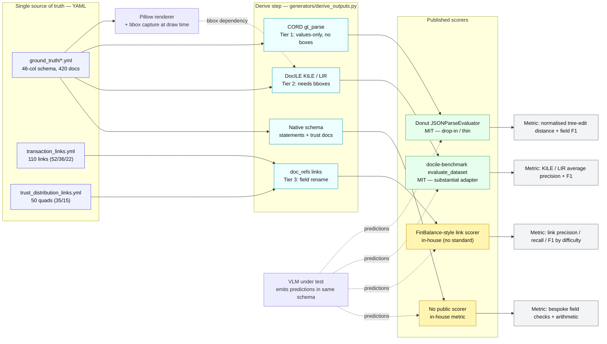

# Ground-Truth Export Specification: Portable Schemas for `Synthetic_Doc_Generation`

**Purpose.** Define how the in-house `Synthetic_Doc_Generation` ground truth is serialised into the recognised CORD and DocILE schemas (for single-document extraction) and a FinBalance-style `doc_refs` convention (for cross-document transaction linking), so that IE and Transaction-Linking VLMs can be scored with standard, published evaluators and the results stay comparable to public leaderboards.

**Status.** Implementation spec. The YAML ground truth remains the single source of truth; every schema below is an additional *derived view*, produced the same way the existing CSV and JSONL derivations are.

**Date.** 23 July 2026.

**Scope.** Receipts and invoices map to CORD and DocILE. Bank statements, credit-card statements, and trust-distribution documents have no public-schema equivalent and are handled as documented extensions. Transaction links and trust-distribution quads map to a `doc_refs` linking convention.

---

## 1. README discrepancies to reconcile before implementing

The repository README is out of date against the authoritative config and data files. Implement against the code and data, not the README. All discrepancies below were verified against literal raw file bytes.

| # | README claim | Location in README | Reality (authoritative source) |
|---|---|---|---|
| 1 | "39-column schema" | `README.md` lines 47, 109, 503 (stated three times) | **46 field columns** in `config/field_definitions.yml` → `all_columns:`. The derived CSV prepends `image_file`, giving **47 CSV columns**. The number 39 corresponds to no list present in the repository. |
| 2 | Column-count rationale | (implicit) | `config/field_definitions.yml` line 2 header comment states **"23 base columns + trust distribution columns."** 23 base + 23 trust = 46. |
| 3 | Transaction-link difficulty split (~50 / ~30 / ~28) | README transaction-linking section | Actual `match_difficulty` distribution in `ground_truth/transaction_links.yml` is **easy 52, medium 36, hard 22** (110 total). Verify against the live file before quoting — this set has been re-seeded at least once. |
| 4 | Ground-truth value types (implied numeric) | (implicit) | Amounts are stored as **quoted decimal strings** (`'13.60'`); ABN and TFN are stored as **space-separated strings** (`79 104 332 181`, `890 838 614`), not integers or floats. Match logic and exact-match scorers must normalise. |
| 5 | Worked examples quote CASE001 as "Bunnings Warehouse / 34.16 / receipt_thermal_80mm" | §4.2, §5.3, §6.1, §6.3 | Live `ground_truth/receipts.yml` CASE001 is `Ravensdale Health Store` / `13.60` / `receipt_fuel`. The repository was re-seeded after the spec was drafted. All examples refreshed in Task 1. |

**Action.** Correct `README.md` (lines 47, 109, 503 and the transaction-linking section) so it agrees with `config/field_definitions.yml` and `ground_truth/transaction_links.yml`. By the project's YAML-as-single-source-of-truth rule, the config is authoritative and the README must not contradict it.

Additional facts confirmed as correct in the README (no change needed): 110 transaction links total; `match_status` is `FOUND` for all 110; 50 trust-distribution quads split 35 compliant / 15 non-compliant.

---

## 2. Authoritative schema (implement against this)

### 2.1 The 46 field columns

Source: `config/field_definitions.yml`, key `all_columns:` (lines 112–159), exact order. The CSV header is `["image_file", *all_columns]` (47 columns).

```
DOCUMENT_TYPE, SUPPLIER_NAME, BUSINESS_ABN, BUSINESS_ADDRESS, GST_AMOUNT,
INVOICE_DATE, IS_GST_INCLUDED, LINE_ITEM_DESCRIPTIONS, LINE_ITEM_QUANTITIES,
LINE_ITEM_PRICES, LINE_ITEM_TOTAL_PRICES, PAYER_ADDRESS, PAYER_NAME,
STATEMENT_DATE_RANGE, TOTAL_AMOUNT, TRANSACTION_AMOUNTS_PAID, TRANSACTION_DATES,
TRANSACTION_DESCRIPTIONS, TRANSACTION_AMOUNTS_RECEIVED, ACCOUNT_BALANCE,
CREDIT_LIMIT, MINIMUM_PAYMENT, PAYMENT_DUE_DATE,
# Trust distribution fields (line 136 comment):
TRUST_NAME, TRUST_TFN, TRUST_ABN, TRUSTEE_NAME, TRUST_ADDRESS, INCOME_YEAR,
TOTAL_NET_INCOME, BENEFICIARY_NAME, BENEFICIARY_TFN, BENEFICIARY_ADDRESS,
SHARE_OF_NET_INCOME, FRANKING_CREDIT, CAPITAL_GAIN_COMPONENT, FOREIGN_INCOME,
TAX_FREE_AMOUNT, TAX_DEFERRED_AMOUNT, DATE_OF_DISTRIBUTION, INDIVIDUAL_NAME,
INDIVIDUAL_TFN, DATE_OF_BIRTH, INDIVIDUAL_ADDRESS, TOTAL_TRUST_INCOME,
TRUST_FRANKING_CREDIT
```

### 2.2 Fields used per document type

Source: `document_fields:` map (lines 4–110). Fields not applicable to a document type are written as the literal `NOT_FOUND` in the CSV (the JSONL omits them entirely).

- **bank_statement**: DOCUMENT_TYPE, SUPPLIER_NAME, STATEMENT_DATE_RANGE, TRANSACTION_DATES, TRANSACTION_DESCRIPTIONS, TRANSACTION_AMOUNTS_PAID, TRANSACTION_AMOUNTS_RECEIVED, ACCOUNT_BALANCE, PAYER_NAME
- **receipt**: DOCUMENT_TYPE, SUPPLIER_NAME, BUSINESS_ABN, BUSINESS_ADDRESS, INVOICE_DATE, IS_GST_INCLUDED, GST_AMOUNT, TOTAL_AMOUNT, LINE_ITEM_DESCRIPTIONS, LINE_ITEM_QUANTITIES, LINE_ITEM_PRICES, LINE_ITEM_TOTAL_PRICES
- **invoice**: receipt fields, plus PAYER_NAME, PAYER_ADDRESS
- **cc_statement**: DOCUMENT_TYPE, SUPPLIER_NAME, STATEMENT_DATE_RANGE, TRANSACTION_DATES, TRANSACTION_DESCRIPTIONS, TRANSACTION_AMOUNTS_PAID, ACCOUNT_BALANCE, CREDIT_LIMIT, MINIMUM_PAYMENT, PAYMENT_DUE_DATE, PAYER_NAME
- **trust_return**: DOCUMENT_TYPE, TRUST_NAME, TRUST_TFN, TRUST_ABN, TRUSTEE_NAME, TRUST_ADDRESS, INCOME_YEAR, TOTAL_NET_INCOME, BENEFICIARY_NAME, BENEFICIARY_TFN, SHARE_OF_NET_INCOME, FRANKING_CREDIT, CAPITAL_GAIN_COMPONENT, FOREIGN_INCOME
- **distribution_statement**: DOCUMENT_TYPE, TRUST_NAME, TRUST_ABN, TRUST_ADDRESS, DATE_OF_DISTRIBUTION, INCOME_YEAR, BENEFICIARY_NAME, BENEFICIARY_TFN, BENEFICIARY_ADDRESS, SHARE_OF_NET_INCOME, FRANKING_CREDIT, CAPITAL_GAIN_COMPONENT, FOREIGN_INCOME, TAX_FREE_AMOUNT, TAX_DEFERRED_AMOUNT
- **trust_income_schedule**: DOCUMENT_TYPE, TRUST_NAME, TRUST_ABN, BENEFICIARY_NAME, BENEFICIARY_TFN, SHARE_OF_NET_INCOME, FRANKING_CREDIT, CAPITAL_GAIN_COMPONENT, FOREIGN_INCOME
- **beneficiary_itr**: DOCUMENT_TYPE, INDIVIDUAL_NAME, INDIVIDUAL_TFN, DATE_OF_BIRTH, INDIVIDUAL_ADDRESS, TOTAL_TRUST_INCOME, TRUST_FRANKING_CREDIT

`document_type_values` (the DOCUMENT_TYPE enum): BANK_STATEMENT, RECEIPT, INVOICE, CC_STATEMENT, TRUST_RETURN, DISTRIBUTION_STATEMENT, TRUST_INCOME_SCHEDULE, BENEFICIARY_ITR.

### 2.3 Field types and formats

Source: `field_types:` and `field_formats:` (lines 171–222).

- **date** (`DD/MM/YYYY`): INVOICE_DATE, PAYMENT_DUE_DATE, DATE_OF_BIRTH, DATE_OF_DISTRIBUTION
- **date_range**: STATEMENT_DATE_RANGE
- **amount** (decimal, no `$`): GST_AMOUNT, TOTAL_AMOUNT, ACCOUNT_BALANCE, CREDIT_LIMIT, MINIMUM_PAYMENT, TOTAL_NET_INCOME, SHARE_OF_NET_INCOME, FRANKING_CREDIT, CAPITAL_GAIN_COMPONENT, FOREIGN_INCOME, TAX_FREE_AMOUNT, TAX_DEFERRED_AMOUNT, TOTAL_TRUST_INCOME, TRUST_FRANKING_CREDIT
- **amount_list** (pipe-delimited `a|b|c`): TRANSACTION_AMOUNTS_PAID, TRANSACTION_AMOUNTS_RECEIVED, LINE_ITEM_PRICES, LINE_ITEM_TOTAL_PRICES
- **date_list**: TRANSACTION_DATES
- **text_list**: LINE_ITEM_DESCRIPTIONS, TRANSACTION_DESCRIPTIONS, LINE_ITEM_QUANTITIES
- **boolean** (`true`/`false`): IS_GST_INCLUDED
- **abn**: BUSINESS_ABN, TRUST_ABN
- **tfn**: TRUST_TFN, BENEFICIARY_TFN, INDIVIDUAL_TFN
- **income_year**: INCOME_YEAR
- **missing-data sentinel**: `NOT_FOUND`

### 2.4 Source-of-truth record shape

Source: `generators/derive_outputs.py` docstring (line 3) and `ground_truth/receipts.yml`.

```yaml
CASE001:
  layout: receipt_fuel
  degradation_seed: 8967
  fields:
    DOCUMENT_TYPE: RECEIPT
    SUPPLIER_NAME: Ravensdale Health Store
    BUSINESS_ABN: 79 104 332 181
    # ... remaining applicable fields ...
```

Derived CSV: header `["image_file", *all_columns]`; `image_file = f"{case_id}_{layout}.png"`; absent fields filled with `NOT_FOUND`. Derived JSONL: one object per doc with `case_id`, `layout`, `degradation_seed`, `image_file`, then the doc's actual `fields` spread in (no `NOT_FOUND` padding).

---

## 3. Normalisation rules (apply before emitting any target schema)

These rules apply to every mapping in sections 4 to 6.

1. **Amounts**: strip surrounding quotes; keep as decimal strings with two places, no `$`. Standard scorers compare value text, so preserve the digits exactly as generated.
2. **Pipe lists**: `LINE_ITEM_*`, `TRANSACTION_*` split on `|`. The four line-item lists are index-aligned and count-consistent (enforced by `generators/schema.py`); zip them by position.
3. **ABN / TFN**: stored space-separated (`79 104 332 181`). Decide a single canonical form for match and export (recommended: keep the spaced human-readable form as `text`, and record a digits-only form for any equality check). Document the choice.
4. **Dates**: `DD/MM/YYYY`. Emit as-is in `text`; do not silently reformat, or ANLS/exact-match comparisons will diverge from the rendered pixels.
5. **`NOT_FOUND`**: never emit into a target schema. A `NOT_FOUND` field is simply absent from the CORD tree / DocILE field list.
6. **`IS_GST_INCLUDED`**: a boolean that selects gross-versus-net target fields in DocILE (section 5). It has no direct slot in either public schema; retain it as generator metadata.

---

## 4. Mapping A — Receipts and Invoices to CORD (`gt_parse`, values-only)

**Applies to**: `receipt`, `invoice`. **Boxes required**: no. **Metric**: tree-edit-distance accuracy (Donut) and field-level F1. **Effort**: low (works from current YAML).

CORD's Donut-style `gt_parse` is a nested value tree. The pipe-delimited line-item lists become one `menu` array.

### 4.1 Field mapping

| Source column | CORD path | Notes |
|---|---|---|
| `LINE_ITEM_DESCRIPTIONS[i]` | `menu[i].nm` | zip by index |
| `LINE_ITEM_QUANTITIES[i]` | `menu[i].cnt` | zip by index |
| `LINE_ITEM_PRICES[i]` | `menu[i].unitprice` | unit price |
| `LINE_ITEM_TOTAL_PRICES[i]` | `menu[i].price` | line total |
| `GST_AMOUNT` | `sub_total.tax_price` | |
| `TOTAL_AMOUNT` | `total.total_price` | |
| `SUPPLIER_NAME` | *(no core CORD field)* | emit under an `extension` key, see 4.3 |
| `BUSINESS_ABN` | *(no core CORD field)* | `extension.business_abn` |
| `BUSINESS_ADDRESS` | *(no core CORD field)* | `extension.business_address` |
| `INVOICE_DATE` | *(no core CORD field)* | `extension.invoice_date` |
| `IS_GST_INCLUDED` | *(metadata)* | not emitted into the tree |
| `PAYER_NAME`, `PAYER_ADDRESS` (invoice) | *(no core CORD field)* | `extension.*` |

### 4.2 Worked example (CASE001, receipt)

Every value below is the live one from `ground_truth/receipts.yml` (re-verified 30 July 2026): supplier Ravensdale Health Store, ABN `79 104 332 181`, total `13.60`, date `07/07/2024`, layout `receipt_fuel`. The arithmetic checks out — `4.73 + 8.87 = 13.60`, and `13.60 / 11 = 1.236…` rounds to the stored `1.24`.

```json
{
  "menu": [
    {"nm": "Dishwashing Liquid", "cnt": "1", "unitprice": "4.73", "price": "4.73"},
    {"nm": "Bandaids 40pk", "cnt": "1", "unitprice": "8.87", "price": "8.87"}
  ],
  "sub_total": {"tax_price": "1.24"},
  "total": {"total_price": "13.60"},
  "extension": {
    "supplier_name": "Ravensdale Health Store",
    "business_abn": "79 104 332 181",
    "business_address": "400 Stewart Rd, South Yarra VIC 3141",
    "invoice_date": "07/07/2024"
  }
}
```

### 4.3 The `extension` key

CORD is receipt-body-centric and has no labelled slot for supplier, ABN, or date. Rather than distort those into `menu`/`total`, place them under a single `extension` object. When scoring against Donut's CORD evaluator, either (a) exclude `extension` from the tree-edit-distance computation for public comparability, or (b) score it separately. Document which.

---

## 5. Mapping B — Invoices and Receipts to DocILE (KILE and LIR)

**Applies to**: `invoice` (primary), `receipt` (subset). **Boxes required**: yes. **Metric**: average-precision-style localisation plus F1. **Effort**: medium (requires box capture, see section 9).

DocILE fields are `{page, bbox: [left, top, right, bottom] (relative 0..1), fieldtype, text, score?}`. KILE = individual fields. LIR = KILE plus a `line_item_id` grouping fields into table rows.

### 5.1 KILE field mapping

| Source column | DocILE `fieldtype` | Notes |
|---|---|---|
| `SUPPLIER_NAME` | `vendor_name` | |
| `BUSINESS_ADDRESS` | `vendor_address` | |
| `BUSINESS_ABN` | `vendor_registration_id` | Confirmed, not `vendor_tax_id` — see §5.4 |
| `INVOICE_DATE` | `date_issue` | |
| `GST_AMOUNT` | `amount_total_tax` | |
| `TOTAL_AMOUNT` | `amount_total_gross` if `IS_GST_INCLUDED` else `amount_total_net` | boolean selects the field |
| `PAYER_NAME` | `customer_billing_name` | |
| `PAYER_ADDRESS` | `customer_billing_address` | |

All strings above confirmed byte-exact against the DocILE field-type enumeration — see §5.4.

**Held in reserve: `date_due`.** DocILE has a `date_due` fieldtype, but **no receipt or invoice source
column populates it.** `PAYMENT_DUE_DATE` exists only in the `cc_statement` field subset
(`config/field_definitions.yml`, verified 30 July 2026), and there is no DocILE mapping for
credit-card statements — they have no public-schema home (see §7). Should the invoice subset ever
gain a due date (the schema change discussed in `Invoice_vs_Receipt.md` §5), the binding is
`PAYMENT_DUE_DATE → date_due`. It is recorded here rather than as a table row so the mapping table
contains only reachable rows.

### 5.2 LIR (line-item) field mapping

Each line-item index `i` becomes a group of fields sharing one `line_item_id = i`:

| Source column | DocILE `fieldtype` |
|---|---|
| `LINE_ITEM_DESCRIPTIONS[i]` | `line_item_description` |
| `LINE_ITEM_QUANTITIES[i]` | `line_item_quantity` |
| `LINE_ITEM_PRICES[i]` | `line_item_unit_price_gross` |
| `LINE_ITEM_TOTAL_PRICES[i]` | `line_item_amount_gross` |

All strings above confirmed byte-exact against the DocILE field-type enumeration — see §5.4.

### 5.3 Worked example (CASE001, KILE fragment)

`bbox` values below are placeholders pending box capture (Task 10); relative coordinates in `[left, top, right, bottom]`.

```json
{
  "kile": [
    {"page": 0, "fieldtype": "vendor_name", "text": "Ravensdale Health Store",
     "bbox": [0.08, 0.04, 0.62, 0.09]},
    {"page": 0, "fieldtype": "vendor_registration_id", "text": "79 104 332 181",
     "bbox": [0.08, 0.10, 0.55, 0.14]},
    {"page": 0, "fieldtype": "date_issue", "text": "07/07/2024",
     "bbox": [0.70, 0.10, 0.95, 0.14]},
    {"page": 0, "fieldtype": "amount_total_gross", "text": "13.60",
     "bbox": [0.72, 0.86, 0.95, 0.90]},
    {"page": 0, "fieldtype": "amount_total_tax", "text": "1.24",
     "bbox": [0.72, 0.80, 0.95, 0.84]}
  ],
  "lir": [
    {"page": 0, "line_item_id": 0, "fieldtype": "line_item_description",
     "text": "Dishwashing Liquid", "bbox": [0.06, 0.40, 0.55, 0.44]},
    {"page": 0, "line_item_id": 0, "fieldtype": "line_item_quantity",
     "text": "1", "bbox": [0.56, 0.40, 0.62, 0.44]},
    {"page": 0, "line_item_id": 0, "fieldtype": "line_item_unit_price_gross",
     "text": "4.73", "bbox": [0.63, 0.40, 0.80, 0.44]},
    {"page": 0, "line_item_id": 0, "fieldtype": "line_item_amount_gross",
     "text": "4.73", "bbox": [0.81, 0.40, 0.95, 0.44]}
  ]
}
```

### 5.4 DocILE `fieldtype` strings and `bbox` convention — confirmed 23 July 2026

Every `fieldtype` string in §5.1 and §5.2, and the `bbox` convention stated in the Mapping B introduction above, were confirmed byte-exact against DocILE's primary sources (not from memory). Sources checked:

- Field-type taxonomy and one-line descriptions for all 35 KILE and 19 LIR field types: Table 1 ("Description of all KILE field types") and Table 2 ("Description of all LIR field types"), pp. 5–6 of the Supplementary Material to the DocILE Benchmark paper, [arXiv:2302.05658](https://arxiv.org/abs/2302.05658) (`docile_supplementary_arxiv_v2.pdf`, bundled in the arXiv source package at `https://arxiv.org/e-print/2302.05658`).
- The same strings appear verbatim in a real annotation file, [`tests/data/sample-dataset/annotations/516f2d61ea404b30a9192a72.json`](https://github.com/rossumai/docile/blob/main/tests/data/sample-dataset/annotations/516f2d61ea404b30a9192a72.json).
- The complete field-type list is independently cross-checked by the evaluation-report tables reproduced in [`tutorials/quickstart.md`](https://github.com/rossumai/docile/blob/main/tutorials/quickstart.md) (the "fieldtype" column of the KILE and LIR AP/F1 report tables enumerates every tracked category, matching Tables 1–2 exactly).
- `Field` and `BBox` dataclass shapes: [`docile/dataset/field.py`](https://github.com/rossumai/docile/blob/main/docile/dataset/field.py) and [`docile/dataset/bbox.py`](https://github.com/rossumai/docile/blob/main/docile/dataset/bbox.py).
- Predictions JSON format and bbox description: [`README.md`, "Predictions format and running evaluation"](https://github.com/rossumai/docile/blob/main/README.md).

**Resolution of the three open bindings:**

1. **`BUSINESS_ABN` → `vendor_registration_id`** (not `vendor_tax_id`). Both strings are real, distinct DocILE fieldtypes — this was a genuine choice, not a typo risk. Table 1 defines `vendor_registration_id` as "Supplier registration identification number" and `vendor_tax_id` as "Supplier tax identification number". An ABN is a business/company identifier issued by the Australian Business Register (incidentally also used in GST administration), which is a registration number, not a tax-file number — the TFN fields (`TRUST_TFN`, `BENEFICIARY_TFN`, `INDIVIDUAL_TFN`) are this project's own tax-file identifiers and stay unmapped to DocILE (no invoice-level TFN concept in the source schema). Confirmed correct as originally assumed.
2. **`LINE_ITEM_PRICES` → `line_item_unit_price_gross`**. Table 2 defines this fieldtype as "Price with tax per unit", matching the project's GST-inclusive unit price. Confirmed correct as originally assumed.
3. **`LINE_ITEM_TOTAL_PRICES` → `line_item_amount_gross`**. Table 2 defines this fieldtype as "Total amount with tax for item", matching the project's GST-inclusive line total. Confirmed correct as originally assumed.

No `fieldtype` string in §5.1 or §5.2 remains unconfirmed.

**`bbox` convention — confirmed.** `bbox` is `[left, top, right, bottom]`, normalised to `[0, 1]`, origin top-left (`top ≤ bottom` with y increasing downward — standard image-coordinate convention, not a Cartesian bottom-left origin). Confirmed in `docile/dataset/bbox.py`, where `BBox.has_valid_relative_coords()` asserts `0 <= left <= right <= 1 and 0 <= top <= bottom <= 1`, and in the README's predictions-format section: "`bbox`: relative coordinates (from 0 to 1) representing the `left`, `top`, `right`, `bottom` sides of the bbox, respectively" and "relative coordinates are used everywhere by default". The library requires a `BBox` object, not a raw list, for in-memory use: `Field.bbox` is typed as `BBox` (a frozen dataclass with fields `left, top, right, bottom`) in `docile/dataset/field.py`, and `Field.from_dict` explicitly constructs `BBox(*bbox_list)` when deserialising. A raw 4-element list/tuple is only the on-disk JSON serialisation form (used by `store_predictions`/`load_predictions` and shown in the README's predictions-format example, e.g. `"bbox": [0.2, 0.1, 0.4, 0.5]`) — the exporter should emit that JSON-list form, but any code that builds `Field` objects directly (rather than writing JSON) must construct a `BBox` instance.

---

## 6. Mapping C — Transaction links to a `doc_refs` convention

**Applies to**: `transaction_links.yml` (110 links) and `trust_distribution_links.yml` (50 quads). **Public standard**: none exists; this follows the nearest convention, FinBalance's `doc_refs` ([arXiv:2606.15949](https://arxiv.org/abs/2606.15949)). This is the project's novel contribution, so the convention is defined here rather than inherited.

### 6.1 Source link shape (verbatim)

`ground_truth/transaction_links.yml`, first entry:

```yaml
CASE001_receipt_fuel.png:
- bank_statement: CASE001_cba_standard.png
  supplier: Ravensdale Health Store
  receipt_date: 07/07/2024
  receipt_total: '13.60'
  bank_date: 07/07/2024
  bank_description: VISA DEBIT PURCHASE SQ *RAVENSDALE Alexandria AU
  bank_amount: '13.60'
  match_status: FOUND
  match_difficulty: medium
  notes: "Early row on cba standard — exact date and amount, abbreviated merchant reference"
```

Re-verified byte-for-byte against the live file 30 July 2026. (The `notes` value is stored with an escaped `—` and a wrapped continuation line in the YAML; the em dash above is that same character rendered.)

The parent YAML key is the source document; the value is a list (one receipt may link to several bank rows). Match evidence is `supplier + date + amount + description` (there is no numeric transaction id).

### 6.2 Transaction-link mapping

| Source key | `doc_refs` field |
|---|---|
| parent key (receipt/invoice image) | `source_doc` |
| `bank_statement` | `target_doc` |
| `supplier`, `receipt_date`, `receipt_total` | `match_keys` (source-side evidence) |
| `bank_date`, `bank_description`, `bank_amount` | `target_evidence` |
| `match_status` | `label` |
| `match_difficulty` | `difficulty` (`easy` \| `medium` \| `hard`) |
| `notes` | `notes` (optional, human-readable) |

Emitted form:

```json
{
  "link_type": "receipt_to_bank",
  "source_doc": "CASE001_receipt_fuel.png",
  "target_doc": "CASE001_cba_standard.png",
  "match_keys": {"supplier": "Ravensdale Health Store", "date": "07/07/2024", "amount": "13.60"},
  "target_evidence": {"date": "07/07/2024",
    "description": "VISA DEBIT PURCHASE SQ *RAVENSDALE Alexandria AU", "amount": "13.60"},
  "label": "FOUND",
  "difficulty": "medium",
  "notes": "Early row on cba standard — exact date and amount, abbreviated merchant reference"
}
```

Verified counts: 110 links; difficulty easy 52 / medium 36 / hard 22; `match_status` FOUND for all 110.

### 6.3 Trust-distribution quad mapping

`ground_truth/trust_distribution_links.yml`, compliant entry (verbatim):

```yaml
CASE201_dist_table_plain.png:
  trust_return: CASE201_trust_return_standard.png
  trust_income_schedule: CASE201_trust_income_schedule_standard.png
  beneficiary_itr: CASE201_beneficiary_itr_standard.png
  linking_fields:
    trust_abn: 79 104 332 181
    beneficiary_tfn: 890 838 614
    share_of_net_income: '73078.48'
    franking_credit: '20985.50'
    capital_gain_component: '6026.13'
  compliance_status: compliant
  discrepancy_type: null
  discrepancy_details: null
  match_status: FOUND
```

Mapping: the parent key (distribution statement) is the anchor `source_doc`; `trust_return`, `trust_income_schedule`, `beneficiary_itr` become the `doc_refs` list; `linking_fields` (the five: `trust_abn`, `beneficiary_tfn`, `share_of_net_income`, `franking_credit`, `capital_gain_component`) become `match_keys`; `compliance_status`, `discrepancy_type`, `discrepancy_details`, `match_status` become the label block.

```json
{
  "link_type": "trust_distribution_quad",
  "source_doc": "CASE201_dist_table_plain.png",
  "doc_refs": [
    "CASE201_trust_return_standard.png",
    "CASE201_trust_income_schedule_standard.png",
    "CASE201_beneficiary_itr_standard.png"
  ],
  "match_keys": {
    "trust_abn": "79 104 332 181",
    "beneficiary_tfn": "890 838 614",
    "share_of_net_income": "73078.48",
    "franking_credit": "20985.50",
    "capital_gain_component": "6026.13"
  },
  "label": {"compliance_status": "compliant", "discrepancy_type": null,
    "discrepancy_details": null, "match_status": "FOUND"}
}
```

Verified counts: 50 quads; 35 compliant / 15 non-compliant. `discrepancy_type` frequencies among the non-compliant: `under_reported_income` 5, `over_claimed_franking` 4, `missing_cgt` 3, `trust_return_mismatch` 3 (35 are `null` when compliant).

---

## 7. Document types with no public-schema home (extensions)

Bank statements, credit-card statements, and all four trust-distribution document types have **no equivalent in CORD or DocILE**. Neither public schema models a statement transaction register or a trust income schedule. For these document types:

- Do not force-fit into CORD or DocILE.
- Emit the native 46-column-derived JSON as the ground truth.
- Treat them as the project's differentiators; they are the whitespace no public benchmark covers.

For statements, the transaction register (`TRANSACTION_DATES`, `TRANSACTION_DESCRIPTIONS`, `TRANSACTION_AMOUNTS_PAID`, `TRANSACTION_AMOUNTS_RECEIVED`, `ACCOUNT_BALANCE`) can be serialised as a per-row array (one object per index across the aligned pipe lists), analogous to the CORD `menu` unzip, but under a project-defined `transactions` schema rather than a public one.

---

## 8. Evaluation machinery: published scorers each schema unlocks

The payoff of emitting to these schemas is that **published, reusable scoring code already consumes them**. This section records what exists, so the implementer sees the reward next to each export target. The governing distinction is **metric versus plumbing**: the metric math is a solved, pip-installable, permissively licensed commodity that takes your own predictions and ground truth (nothing is hardwired to the public datasets); the only variable is how much adapter code shapes your data into each evaluator's expected structure.

### 8.1 Schema-specific scorers (all accept custom predictions + ground truth)

| Schema | Published scorer | Install | Metric | Licence |
|---|---|---|---|---|
| CORD | Donut `JSONParseEvaluator` (`donut/util.py`) | `pip install donut-python`, or copy (deps `zss` + `nltk`) | normalised tree-edit-distance accuracy + field-level F1 | MIT |
| DocILE | `docile-benchmark` → `evaluate_dataset()` | `pip install docile-benchmark` | KILE / LIR average precision + F1 | MIT |
| FUNSD | `seqeval` (+ `nervaluate` for partial/exact schemes) | `pip install seqeval` | entity-level F1 | MIT |
| DocVQA | `anls` (or `anls_star`) | `pip install anls` | ANLS (τ = 0.5) | MIT |

Each was confirmed against primary sources to score arbitrary pred/GT, not just the fixed public corpus: Donut [clovaai/donut `util.py`](https://github.com/clovaai/donut/blob/master/donut/util.py) (`cal_acc(pred, gt)` on single dicts, `cal_f1(preds, gts)` on lists); DocILE [rossumai/docile `evaluate.py`](https://github.com/rossumai/docile/blob/main/docile/evaluation/evaluate.py) (`evaluate_dataset(dataset, docid_to_kile_predictions, docid_to_lir_predictions, iou_threshold)`); [seqeval](https://github.com/chakki-works/seqeval) (`f1_score(y_true, y_pred)` over BIO tag lists); [anls](https://github.com/shunk031/ANLS) (`anls_score(prediction, gold_labels, threshold=0.5)`).

**Do not** reach for a HuggingFace `evaluate` ANLS metric: there is no official one (the request in [huggingface/evaluate #321](https://github.com/huggingface/evaluate/issues/321) was never merged). Use the `anls` package.

### 8.2 Standalone metric libraries (pure commodity, zero dataset)

These operate on two plain Python objects and return a number; useful when you serialise fields yourself:

- [`anls`](https://github.com/shunk031/ANLS) (ANLS), [`seqeval`](https://github.com/chakki-works/seqeval) (entity F1), [`nervaluate`](https://github.com/MantisAI/nervaluate) (SemEval strict/exact/partial/type) — all MIT.
- [`table-recognition-metric`](https://pypi.org/project/table-recognition-metric/) — pip-installable TEDS (tree-edit-distance similarity for tables), Apache-2.0, `TEDS()(pred_html, gt_html)` on arbitrary HTML strings. Built on [`apted`](https://pypi.org/project/apted/) (MIT), the same building block as IBM's PubTabNet `metric.py`.
- [`rapidfuzz`](https://github.com/rapidfuzz/RapidFuzz) (MIT) for Levenshtein/fuzzy ratios. Prefer `apted` and `rapidfuzz` over `zss` and `Levenshtein`, whose licences are non-SPDX / historically GPL (confirm before use).

### 8.3 Glue required per export target

| Target | Metric package | Remaining glue |
|---|---|---|
| DocVQA-style (ANLS) | `anls` | **Drop-in** — pass prediction string + gold strings |
| FUNSD entity F1 | `seqeval` / `nervaluate` | **Zero-to-thin** — emit BIO tags or `{label, start, end}` spans |
| CORD parse | Donut `JSONParseEvaluator` | **Thin adapter** — emit `gt_parse` JSON (Mapping A), call the evaluator |
| Table structure (TEDS) | `table-recognition-metric` | **Thin adapter** — emit `<table>` HTML for pred + truth |
| **DocILE KILE/LIR** | `docile-benchmark` | **Substantial** — build a conforming `Dataset` of gold annotations + `Field` predictions (correct bbox/fieldtype/`line_item_id`) and pass its validation gauntlet |

DocILE is the one place the plumbing, not the metric, is the cost, and it lines up with the box-capture dependency below: it is a **Tier 2** effort (see section 9), whereas the CORD (Tier 1) and `doc_refs` (Tier 3) paths give a published or trivial scorer for far less work.

### 8.4 Full VLM harnesses (bigger lever, adapter in every case)

If the goal is a leaderboard-style multi-model run rather than per-schema scoring:

- **[lmms-eval](https://github.com/EvolvingLMMs-Lab/lmms-eval)** (MIT / Apache-2.0, actively maintained) and **[VLMEvalKit](https://github.com/open-compass/VLMEvalKit)** (Apache-2.0, actively maintained) cover DocVQA, InfographicVQA, OCRBench(v2), ChartQA. **Neither ships CORD, FUNSD, or DocILE as a built-in task.** Adding a private synthetic dataset means writing a dataset adapter (lmms-eval: a YAML task + `doc_to_messages`; VLMEvalKit: a TSV of base64 images + a subclass whose `evaluate()` is where you plug in KIE set-F1).
- **[DUE evaluator](https://github.com/due-benchmark/evaluator)** reuses audited ANLS / set-F1 / GROUP-ANLS on custom data via its DU-Schema, but it is stale and **ships no LICENSE file** — treat as all-rights-reserved and resolve licensing before organisational use.
- **[OCRBench v2](https://github.com/Yuliang-Liu/MultimodalOCR)** is **research-only, non-commercial** — a blocker for organisational use; run it only as a fixed public benchmark, not on internal data.

### 8.5 Evaluation-machinery caveats

- DUE evaluator licence: no LICENSE file located; confirm before any organisational use.
- `zss` and `Levenshtein` licences: reported non-SPDX / historic GPL; prefer `apted` (MIT) and `rapidfuzz` (MIT).
- VLMEvalKit lacking CORD/FUNSD/DocILE is a documented-absence, not an exhaustive audit.
- FUNSD conformance is against the community JSON `features` spec, not one blessed HuggingFace loader script.

### 8.6 Pipeline overview (export to scoring)



The green path (CORD, DocILE) is free published MIT scoring code; the only build cost is the derive adapters plus bbox capture. The amber path (transaction links, native statement/trust schemas) has no public scorer and is where the in-house tool leads the market.

## 9. The one hard dependency: bounding boxes

The current ground-truth YAML stores field **values only, no coordinates**. CORD's `gt_parse` path (Mapping A) does not need boxes and can ship immediately. DocILE (Mapping B) requires `bbox` for every field, because its metrics are localisation-based.

The renderer (`generators/`, Pillow-based) already positions every element, so the coordinates exist at draw time and are simply not persisted. The change is capture-and-serialise at render time, not new manual annotation:

1. At the point each field string is drawn, record its pixel box.
2. Normalise to relative `[left, top, right, bottom]` in `[0, 1]` against the page dimensions.
3. Persist alongside the value in the ground-truth record (or a parallel geometry file keyed by case id and field).

Effort tiers:

- **Tier 1 (low)**: CORD `gt_parse` export for receipts and invoices. No renderer change. Unlocks Donut-style tree-edit-distance and field-F1 scoring now.
- **Tier 2 (medium)**: box capture in the renderer, then DocILE KILE/LIR export. Unlocks localisation metrics (AP/IoU).
- **Tier 3 (low, independent)**: `doc_refs` link export (Mapping C). Pure rename of existing link fields, no renderer change.

---

## 10. Implementer reference: source file paths

- `config/field_definitions.yml` — authoritative schema: `document_fields`, `all_columns` (46-col order), `document_type_values`, `field_formats`, `field_types`.
- `generators/schema.py` — ground-truth YAML validator (doc-type enum, required-fields-per-type, date/amount/ABN/TFN format and checksum checks, pipe-list count consistency).
- `generators/derive_outputs.py` — `derive_csv` / `derive_jsonl` (CSV column order, `NOT_FOUND` logic, JSONL layout). Add `derive_cord`, `derive_docile`, `derive_links` here.
- `ground_truth/transaction_links.yml` — 110 receipt/invoice to bank links.
- `ground_truth/trust_distribution_links.yml` — 50 trust-distribution quads.
- `ground_truth/{bank_statements,receipts,invoices,cc_statements,trust_returns,distribution_statements,trust_income_schedules,beneficiary_itrs}.yml` — per-doc-type ground truth.
- `scripts/seed_ground_truth.py`, `seed_transaction_links.py`, `seed_trust_distributions.py`, `seed_trust_distribution_links.py` — seeding scripts.
- Regeneration entry point: `python -m generators.pipeline derive`.

---

## 11. Open items to confirm before finalising

1. ~~**DocILE `fieldtype` strings** — confirm byte-exact against [github.com/rossumai/docile](https://github.com/rossumai/docile), especially the ABN target (`vendor_registration_id` vs `vendor_tax_id`) and gross/net unit-price field names.~~ Completed 23 July 2026: all §5.1/§5.2 `fieldtype` strings, and the `bbox` convention, confirmed against the DocILE paper's Supplementary Material ([arXiv:2302.05658](https://arxiv.org/abs/2302.05658), Tables 1–2) and the [rossumai/docile](https://github.com/rossumai/docile) repository. `BUSINESS_ABN` → `vendor_registration_id` (not `vendor_tax_id`); `LINE_ITEM_PRICES` → `line_item_unit_price_gross`; `LINE_ITEM_TOTAL_PRICES` → `line_item_amount_gross` — all as originally assumed. See §5.4.
2. **CORD `extension` handling** — decide whether supplier/ABN/date are excluded from or scored separately in the tree-edit-distance comparison, for public comparability.
3. **ABN/TFN canonical form** — spaced vs digits-only for the `text` field and for equality checks; document the decision.
4. ~~**CASE001 line items** — the worked examples in 4.2 and 5.3 use placeholder line items; replace with the real pipe-list contents.~~ Completed in Task 1: §4.2, §5.3, §6.1, §6.3 now quote the live CASE001 / CASE201 values.
5. ~~**README correction** — apply the section 1 fixes so the README stops asserting "39 columns" and the wrong difficulty split.~~ Completed in Task 1: see `README.md`.
